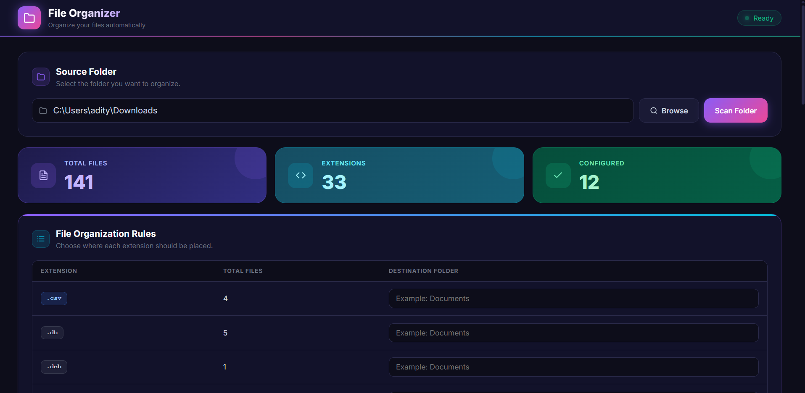
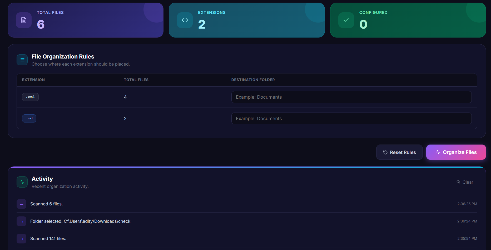
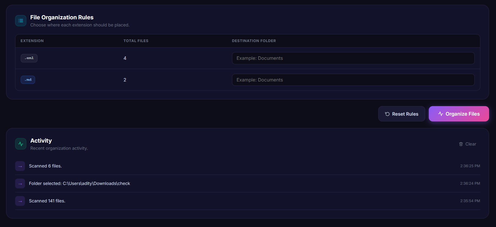

# ADX File Organizer

A desktop application built with Electron for organizing files by extension. Browse a folder, scan its contents, set destination rules per extension, and move everything in one click.

## Screenshots







## Features

- Browse and scan any folder on your system
- Auto-detects all file extensions present
- Color-coded extension badges by file type (images, video, audio, docs, code, archives)
- Set a custom destination folder per extension — supports both absolute paths and relative paths
- Skips extensions with no destination configured (with confirmation)
- Activity log with success/error entries
- Summary stats: total files, extensions found, rules configured

## Usage

1. Click **Browse** to select a source folder, or use the default Downloads folder
2. Click **Scan Folder** to detect all file extensions
3. Fill in destination folders for the extensions you want to move:
   - Relative path: `Images` → creates/uses `{source}\Images`
   - Absolute path: `C:\Users\you\Pictures` → moves files directly there
4. Click **Organize Files**

## Installation

```bash
npm install
npm start
```

## Build to .exe

Replace the package.json with following:
```
{
  "scripts": {
    "start": "electron .",
    "build": "electron-builder --win"
  },
  "build": {
    "appId": "com.adx.file-organizer",
    "productName": "File Organizer",
    "directories": {
      "output": "dist"
    },
    "win": {
      "target": "nsis",
      "icon": "assets/icon.ico"
    },
    "files": [
      "src/**/*",
      "package.json"
    ]
  }
}

```
Than run following cmds:
```bash
npm install --save-dev electron-builder
npm run build
```

The installer will be output to the `dist/` folder. To get a single portable `.exe` instead of an installer, set `"target": "portable"` in the `build.win` section of `package.json`.

## Tech Stack

- [Electron](https://www.electronjs.org/)
- Vanilla JS + HTML/CSS (no frontend framework)
- Node.js `fs` module for file operations

## License

MIT
